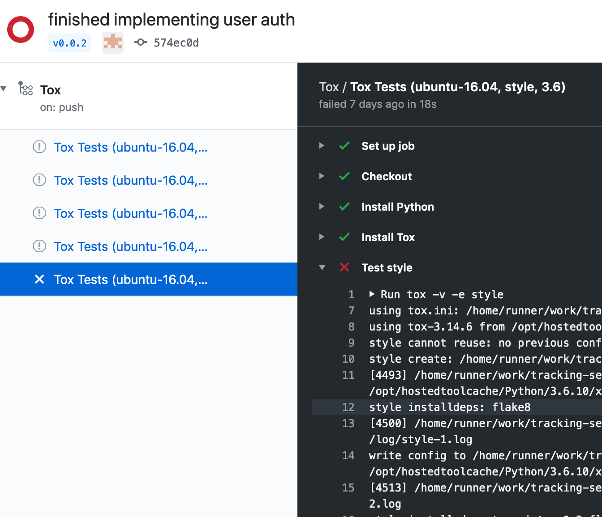
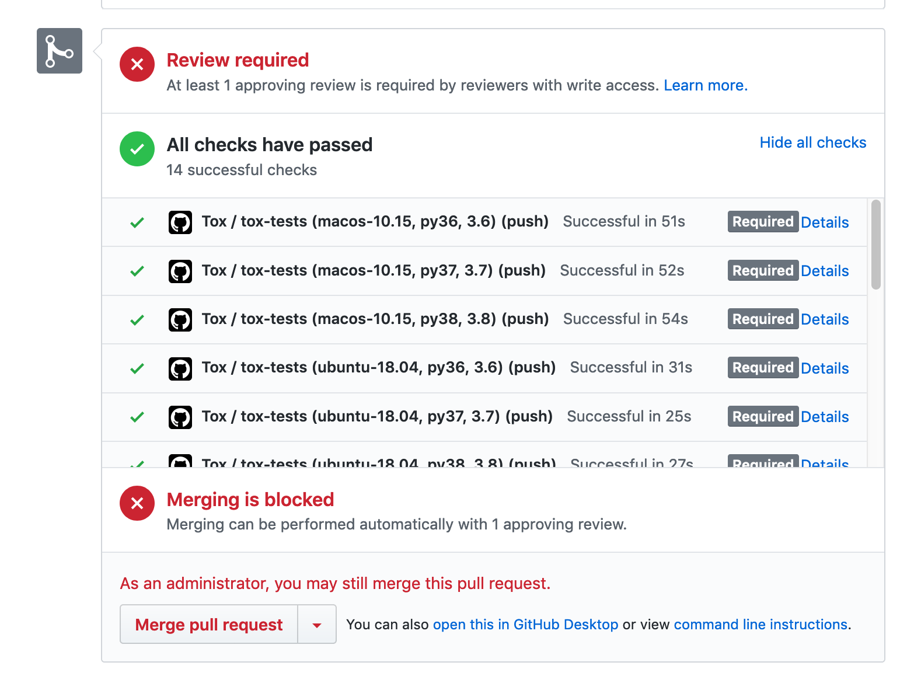

# IDiet Tracking Backend


## Test Generation
The open source projects `hypothesis` and `faker` can be used to generate
test data in a declarative approach. The below example shows a simple case of asking hypothsis to provide the test function with emails e.g. `{random-string}@{random-string}` and text for a password. 
```python
# tests/test_user.py
import hypthosesis.strategies as st
from hypothesis import settings, given

@given(email=st.emails(), password=st.text(min_len=10))
@settings(max_examples=10)
def test_user_can_authenticate(email, password):
    print(email, password)
```
```sh
~ pytest tests/test_user.py
0@A.com 00000000
0@A.com 00000000
r/&o@P00C00-50-NmF8a0tB-f--9113.d.P3Qy.Mp 𡬍񐝕􊘸𱨽0򜻪𜜯
@A.com 00000000
j@A.com 00000000
ji@pHo-6-C.nO 󹿒򥓐󠦵󠬞󑰛򐻀𨯣򿸢񌵻󨎕󮋄)򴆼/򬘗󭮔󷛸)胢񲛢
#@A.com 00000000
#xK#D}0dLy0/@z.Jj.bOAts !𖣝(򽣋󣒶
N@A.com 00000000
Nq#0ma30&0X}*%!+@V.Lu 󰎎&񉙰񝖴(񈿨.
tests/test_user.py .                                                                         [100%]

======================= 1 passed in 0.02s ========================
```
The above example includes alot of interesting unicode characters. While this might provide a lot of edge cases it will definitely become harder to debug. To limit the password to just ascii characters we can tell hypthosis what type of characters are acceptable by specifying the alphabet.
```python
# test_encrypt.py
from string import ascii_letters
import hypthosesis.strategies as st
from hypothesis import settings, given 

@given(password=st.text(min_size=10, alphabet=ascii_letters))
@settings(max_examples=5)
def test_encrypt(password):
    print(password)
```
```sh
~ pytest tests/test_encrypt.py
collected 1 item

ABAABAABAA
AAAAAAAAAA
YAAAAAAAAA
YGSgSPTBKVMisLBYgJXetVPWtlxJhpZ
AAAAAAAAAA
tests/test_encrypt.py .                                                                         [100%]

======================= 1 passed in 0.02s ========================
```
### Configuring Test Environments
Test generation can be configured for each environment with command line arguments, environment variables, etc. For example, in a CI pipeline, we might want to be more aggressive with testing, especially for something like a nightly build. We can configure this in our `tests/conftest.py` file.

```python
from hypthesis import settings

settings.register_profile("debug", max_examples=1)
settings.register_profile("fast", max_examples=10)
settings.register_profile("slow", max_examples=100)
settings.register_profile("nightly", max_examples=1000)
settings.register_profile("execution_time", max_examples=100, deadline=100)
```
So for tests I might run 

* debug: for test driven development - constantly running local tests
* fast: before a commit
* slow: after a push event on github for branches. Developers are expensive so don't waste too much of their time
* nightly: run on a cron schedule on master every night

Example - git commit
```sh
function git-commit () {
    pytest -v -s tests --hypothesis-profile fast && git commit $@
}

git-commit -m "FEATURE user can reset lost password" 
```

Example - github actions - ci pipeline
```yaml
name: Run iDiet Tracking Tests
on:
  schedule:
    - cron:  '0 22 * * *'
  push:
  steps:
    ... 
    - if: github.event_name == 'schedule'
      env:
        HYPOTHESIS_PROFILE: nightly
      run: |
        pytest -s -v tests
    - if: github.event_name == 'push'
      env:
        HYPOTHESIS_PROFILE: slow
      run: |
        pytest -s -v tests
    ...
```

The following is a test pulled from the test suite
```python
class TestRegisterView(object):
    @given(
        username=st.emails(),
        password=st.text(alphabet=ascii_letters)
    )
    def test_register_user(self, username, password):
        app = webtest.TestApp(create_app())

        post_data = {"username": username, "password": password}
        response = app.post_json("/api/register", post_data)
        assert response.status_code == 201
        assert response.json["status"] == "success"
```
```sh
~ pytest -v -s tests --hypothesis-show-statistics --hypothesis-profile slow -k test_register_user

tests/test_api.py::TestRegisterView::test_register_user PASSED
tests/test_api.py::TestRegisterView::test_register_user_twice PASSED
======================= Hypothesis Statistics ==============================

tests/test_api.py::TestRegisterView::test_register_user:

  - 100 passing examples, 0 failing examples, 1 invalid examples
  - Typical runtimes: 116-154 ms
  - Fraction of time spent in data generation: ~ 3%
  - Stopped because settings.max_examples=100

tests/test_api.py::TestRegisterView::test_register_user_twice:

  - 100 passing examples, 0 failing examples, 5 invalid examples
  - Typical runtimes: 118-152 ms
  - Fraction of time spent in data generation: ~ 3%
  - Stopped because settings.max_examples=100

===================== 2 passed, 12 deselected in 26.19s ===================
```

We can also constrain the test to execute within a certain threshold. Using the
profile `execution_time` above we can contain the test execution time. 

```sh
~ pytest tests --hypothesis-profile execution_time

============================================= short test summary info =============================================
FAILED tests/test_api.py::TestRegisterView::test_register_user - hypothesis.errors.DeadlineExceeded: Test took 1...
FAILED tests/test_api.py::TestRegisterView::test_register_user_twice - hypothesis.errors.DeadlineExceeded: Test ...
FAILED tests/test_api.py::TestLoginView::test_user_can_get_token - hypothesis.errors.DeadlineExceeded: Test took...
FAILED tests/test_api.py::TestLoginView::test_user_cannot_login_with_wrong_password - hypothesis.errors.Deadline...
FAILED tests/test_api.py::TestUserProfileView::test_get - hypothesis.errors.DeadlineExceeded: Test took 266.05ms...
FAILED tests/test_api.py::TestUserProfileView::test_post - hypothesis.errors.DeadlineExceeded: Test took 289.12m...
FAILED tests/test_api.py::TestFoodSearch::test_food_search_exact_match - hypothesis.errors.DeadlineExceeded: Tes...
FAILED tests/test_backend.py::TestBackend::test_add_and_get_user[alchemy] - hypothesis.errors.Flaky: Inconsisten...
```


## Webtest Test Driver
Python implements CGI with a protocol called WSGI. WSGI is a protocol that works with a single function as the entrypoint. The function takes in two arguments and returns a list of unicode strings (the http response).

```python
# taken from pep333 (Python Web Server Gateway Interface v1.0)
def simple_app(environ, start_response):
    """Simplest possible application object"""
    status = '200 OK'
    response_headers = [('Content-type', 'text/plain')]
    start_response(status, response_headers)
    return ['Hello world!\n']
```

This means that making http requests for tests is as simple as pumping values into a function. There's no sockets needed. This more or less allows `unit/integration testing` where `functional/system testing` would typically take place.

The following is a simple test of a wsgi application using the webtest test driver. 

```python
import string

from faker import Faker
import hypothesis.strategies as st, given
import webtest

from idiet.tracking.core import create_app

@given(
    name=st.builds(Faker().name),
    password=st.text(min_size=8, alphabet=ascii_letters)
)
def test_user_can_register(name, password):
    app = create_app()  # get the wsgi function
    test_app = webtest.TestApp(app)  # create an http client

    post_data = {"username": name, "password": password}
    response = test_app.post_json("/api/register", post_data)
    assert response["status"] == "success"
    assert response.status_code in [200, 201, 301]
```


## Test Oracles
There are several layers of test oracles we're currently using for testing. 
* tox
* assert

#### Tox by example
The explain is simply, tox runs test suites. It provides a template for running a set of tests, test isolation and then reports back on whether or not all tests have failed.

```ini
# tox.ini
[tox]
envlist = py36, style, coverage, performance

[testenv]
deps =
    pytest
    -r test-requirements.txt
commands =
    pytest tests  # basic environment runs test quit
```
The above config file allows us to run all the tests in a test suite and provides us will a pass or fail (bash exit code)
```sh
~ tox -e py36 # run the python3.6 environment
```

#### Github Actions
Github actions provides test oracles to help manage pull requests




## Code Coverage
Code coverage is run with just about every test. Coverage tool used
is pytest-cov. It's a plugin for pytest and shows coverage results by line

```sh
~ pytest --cov=idiet --cov-report term-missing --cov-config .coveragerc tests

collected 14 items

tests/test_api.py ........                                                                       [ 57%]
tests/test_backend.py .                                                                          [ 64%]
tests/test_core.py ..                                                                            [ 78%]
tests/test_system.py ..F                                                                                                                                                                                 [100%]

---------- coverage: platform darwin, python 3.6.8-final-0 -----------
Name                                Stmts   Miss Branch BrPart  Cover   Missing
-------------------------------------------------------------------------------
idiet/__init__.py                       0      0      0      0   100%
idiet/tracking/__init__.py              0      0      0      0   100%
idiet/tracking/api.py                  71      6      6      0    92%   90-96, 111-116
idiet/tracking/auth/__init__.py         1      1      0      0     0%   1
idiet/tracking/auth/views.py           96     96      8      0     0%   1-170
idiet/tracking/backend/core.py         22     10      0      0    55%   8-13, 17-18, 36, 40, 43, 57, 60
idiet/tracking/backend/db.py          123     10      0      0    92%   99-106, 156, 159
idiet/tracking/config.py               10     10      2      0     0%   1-15
idiet/tracking/core.py                 38      2      4      1    93%   33->36, 36, 41
idiet/tracking/encrypt.py              16      5      0      0    69%   19-25, 29-30
idiet/tracking/models/__init__.py       1      1      0      0     0%   1
idiet/tracking/models/user.py          23     23      2      0     0%   1-32
idiet/tracking/timestamp.py             4      0      0      0   100%
idiet/tracking/wsgi.py                  3      3      0      0     0%   1-6
-------------------------------------------------------------------------------
TOTAL                                 408    167     22      1    58%
```

## Test Profiling

Pytest comes with a execution time monitor but we can also profile the code 
more in depth with pytest-profiling by adding an additional `--profile` arg. 
to the end of the test command

```sh
~ pytest -m "not system" --cov=idiet --cov-report term-missing \
          --cov-config  .coveragerc --profile --durations=0 tests
collected 14 items / 3 deselected / 11 selected

tests/test_api.py ........                                                           [ 72%]
tests/test_backend.py .                                                              [ 81%]
tests/test_core.py ..                                                                [100%]
Profiling (from /Users/jhoman/School/tracking-server/prof/combined.prof):
Mon Apr 20 18:42:29 2020    /Users/jhoman/School/tracking-server/prof/combined.prof

         442446 function calls (424004 primitive calls) in 1.987 seconds

   Ordered by: cumulative time
   List reduced from 2860 to 20 due to restriction <20>

   ncalls  tottime  percall  cumtime  percall filename:lineno(function)
       11    0.000    0.000    1.991    0.181 runner.py:83(pytest_runtest_protocol)
  167/121    0.001    0.000    1.987    0.016 hooks.py:272(__call__)
  167/121    0.000    0.000    1.986    0.016 manager.py:90(_hookexec)
  167/121    0.000    0.000    1.986    0.016 manager.py:84(<lambda>)
  167/121    0.003    0.000    1.985    0.016 callers.py:157(_multicall)
       11    0.000    0.000    1.984    0.180 runner.py:90(runtestprotocol)
       33    0.000    0.000    1.984    0.060 runner.py:183(call_and_report)
       33    0.000    0.000    1.974    0.060 runner.py:204(call_runtest_hook)
       33    0.000    0.000    1.974    0.060 runner.py:237(from_call)
       33    0.000    0.000    1.973    0.060 runner.py:217(<lambda>)
       11    0.000    0.000    1.951    0.177 runner.py:126(pytest_runtest_call)
       11    0.000    0.000    1.950    0.177 python.py:1477(runtest)
       11    0.000    0.000    1.949    0.177 python.py:175(pytest_pyfunc_call)
        9    0.000    0.000    1.920    0.213 core.py:944(wrapped_test)
        9    0.000    0.000    1.867    0.207 core.py:703(run_engine)
        9    0.000    0.000    1.830    0.203 engine.py:417(run)
        9    0.000    0.000    1.830    0.203 engine.py:812(_run)
        9    0.000    0.000    1.830    0.203 engine.py:439(reuse_existing_examples)
        9    0.000    0.000    1.824    0.203 engine.py:918(cached_test_function)
        9    0.000    0.000    1.823    0.203 engine.py:149(test_function)


---------- coverage: platform darwin, python 3.6.8-final-0 -----------
Name                                Stmts   Miss Branch BrPart  Cover   Missing
-------------------------------------------------------------------------------
idiet/__init__.py                       0      0      0      0   100%
idiet/tracking/__init__.py              0      0      0      0   100%
idiet/tracking/api.py                  71      6      6      0    92%   90-96, 111-116
idiet/tracking/auth/__init__.py         1      1      0      0     0%   1
idiet/tracking/auth/views.py           96     96      8      0     0%   1-170
idiet/tracking/backend/core.py         22     10      0      0    55%   8-13, 17-18, 36, 40, 43, 57, 60
idiet/tracking/backend/db.py          123     10      0      0    92%   99-106, 156, 159
idiet/tracking/config.py               10     10      2      0     0%   1-15
idiet/tracking/core.py                 38      2      4      1    93%   33->36, 36, 41
idiet/tracking/encrypt.py              16      5      0      0    69%   19-25, 29-30
idiet/tracking/models/__init__.py       1      1      0      0     0%   1
idiet/tracking/models/user.py          23     23      2      0     0%   1-32
idiet/tracking/timestamp.py             4      0      0      0   100%
idiet/tracking/wsgi.py                  3      3      0      0     0%   1-6
-------------------------------------------------------------------------------
TOTAL                                 408    167     22      1    58%


================================== slowest test durations ==================================
0.31s call     tests/test_api.py::TestUserProfileView::test_post
0.27s call     tests/test_api.py::TestFoodSearch::test_food_search_exact_match
0.27s call     tests/test_api.py::TestUserProfileView::test_get
0.27s call     tests/test_api.py::TestLoginView::test_user_cannot_login_with_wrong_password
0.26s call     tests/test_api.py::TestLoginView::test_user_can_get_token
0.24s call     tests/test_api.py::TestRegisterView::test_register_user
0.15s call     tests/test_api.py::TestRegisterView::test_register_user_twice
0.14s call     tests/test_backend.py::TestBackend::test_add_and_get_user[alchemy]
0.03s call     tests/test_api.py::TestLoginView::test_user_cannot_get_token_if_dne
0.02s call     tests/test_core.py::TestTracking::test_create_app_with_config
0.01s call     tests/test_core.py::TestTracking::test_create_app
0.01s setup    tests/test_backend.py::TestBackend::test_add_and_get_user[alchemy]

(0.00 durations hidden.  Use -vv to show these durations.)
```


## Monday - May 4, 2020
### Test Case - Encryption Key Enabled

Verify that the application will not be created without an encryption key. The
encryption key is used for storing hashes of sensitive data and for generating
OAuth tokens for API requests.

```python
def test_create_app_fails_when_missing_key(self):

    config = {
        "secret-key": ""
    }
    with pytest.raises(ValueError):
        app = create_app(config=config)
```

### Test Case - Encryption Key Not Stored in application binary
Verify the secrets aren't being stored in the application binary
```yaml
metadataTest:
env:
  - key: IDIET_TRACKING_SECRET
    value: ""
```
